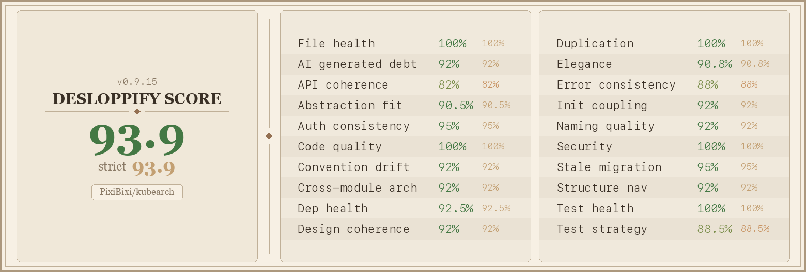

# kubearch




**kubearch** is a Kubernetes Prometheus exporter that reports the CPU architectures supported by every container image running in your cluster, without pulling image layers.

It reads each pod's image references, fetches the OCI manifest list from the registry, and exposes the supported platforms as Prometheus metrics. Useful for tracking multi-arch readiness, identifying images blocking arm64 migrations, or auditing mixed-architecture clusters.

## How it works

```text
K8s API (pod watch)
      │
      ▼  new image detected
work queue (10 workers, dedup, retry with backoff)
      │
      ▼
Registry API (OCI manifest, no layers pulled)
      │
      ▼
Prometheus /metrics
```

- Watches pod `Add`/`Update`/`Delete` events via a shared informer, **no polling**
- Inspects each image only **once** (in-memory store, invalidated when the last pod using it is deleted)
- Reads manifests only, never layers. Multi-arch images need one request; single-arch
  images need a second one for the config blob, which is where the platform is recorded
- Bounded work: 10 concurrent inspections, a 30 s deadline per attempt, and 5 retries
  with exponential backoff before an image is dropped
- Authenticates via `imagePullSecrets` and service account pull secrets, with anonymous
  fallback. Credentials are cached for 5 min per `(namespace, service account, pull secrets)`
  and evicted on `401`/`403`, so a rotated secret is picked up on the next attempt
- Supports public registries (Docker Hub, ghcr.io, gcr.io, ECR, ACR, ...) and private ones

## Metrics

| Metric | Type | Labels | Description |
|---|---|---|---|
| `kubearch_image_platform_supported` | Gauge | `image`, `digest`, `os`, `arch` | Always `1`. One time series per supported platform. |
| `kubearch_image_platform_count` | Gauge | `image`, `digest` | Total number of platforms the image supports. |
| `kubearch_image_multi_arch` | Gauge | `image`, `digest` | `1` if the image supports more than one platform, `0` otherwise. |

The `digest` label mints a new time series every time an image is rebuilt
under the same tag, which Prometheus never reclaims on its own. Pass
`-digest-label=false` to drop it from all three families. Note that it buys
you nothing if your pod specs already pin images by digest
(`repo:tag@sha256:…`, as GKE does): the digest is part of the `image` label
in that case.

### Self-monitoring metrics

Without these, a total inspection outage (expired credentials, unreachable
registry) looks exactly like an empty cluster: the image metrics simply
disappear.

| Metric | Type | Labels | Description |
| --- | --- | --- | --- |
| `kubearch_build_info` | Gauge | `version`, `commit`, `go_version` | Always `1`. Build metadata of the running binary. |
| `kubearch_inspections_total` | Counter | `result` | Inspection attempts, `result` is `success` or `failure`. |
| `kubearch_inspection_retries_total` | Counter | - | Failed inspections requeued for another attempt. |
| `kubearch_inspection_duration_seconds` | Histogram | - | Latency of registry calls. |
| `kubearch_store_images` | Gauge | - | Images with a known result. |
| `kubearch_store_pending_inspections` | Gauge | - | Inspections in flight. |
| `kubearch_store_pods` | Gauge | - | Pods currently tracked. |
| `kubearch_queue_depth` | Gauge | - | Images waiting in the work queue. |

`kubearch_inspections_total` only appears once an inspection has been attempted:
a Prometheus `CounterVec` exposes nothing until a label value is observed.

### Example output

```text
kubearch_image_platform_supported{arch="amd64",digest="sha256:abc…",image="nginx:1.27",os="linux"} 1
kubearch_image_platform_supported{arch="arm64",digest="sha256:abc…",image="nginx:1.27",os="linux"} 1
kubearch_image_platform_supported{arch="arm",digest="sha256:abc…",image="nginx:1.27",os="linux"}   1

kubearch_image_platform_count{digest="sha256:abc…",image="nginx:1.27"} 3
kubearch_image_multi_arch{digest="sha256:abc…",image="nginx:1.27"}     1
```

### Useful PromQL queries

```promql
# Images that support only one platform (single-arch)
kubearch_image_multi_arch == 0

# Images without linux/arm64 support (arm64 migration blockers)
group by (image, digest) (kubearch_image_platform_count)
  unless on (image, digest)
  (kubearch_image_platform_supported{os="linux", arch="arm64"})

# Number of platforms per image, sorted
sort_desc(kubearch_image_platform_count)

# All platforms supported by images in a specific namespace
# (requires joining with kube_pod_container_info from kube-state-metrics)
kubearch_image_platform_supported * on (image) group_left()
  kube_pod_container_info{namespace="production"}
```

Watching the exporter itself:

```promql
# Inspection failure ratio, alert above a few percent
sum(rate(kubearch_inspections_total{result="failure"}[15m]))
  / sum(rate(kubearch_inspections_total[15m]))

# Images the exporter never managed to resolve (queue drained, nothing pending)
kubearch_store_pods > 0 and kubearch_store_images == 0

# Backlog not draining: registry unreachable or rate-limiting us
kubearch_queue_depth > 0 and rate(kubearch_inspection_retries_total[10m]) > 0

# p99 registry latency
histogram_quantile(0.99, sum by (le) (rate(kubearch_inspection_duration_seconds_bucket[15m])))
```

## Installation

### Helm (recommended)

```bash
helm upgrade --install kubearch oci://ghcr.io/PixiBixi/kubearch/charts/kubearch \
  --namespace monitoring \
  --create-namespace
```

With Prometheus Operator (kube-prometheus-stack):

```bash
helm upgrade --install kubearch oci://ghcr.io/PixiBixi/kubearch/charts/kubearch \
  --namespace monitoring \
  --create-namespace \
  --set serviceMonitor.enabled=true \
  --set serviceMonitor.labels.release=kube-prometheus-stack
```

Restricted to a single namespace:

```bash
helm upgrade --install kubearch oci://ghcr.io/PixiBixi/kubearch/charts/kubearch \
  --namespace monitoring \
  --create-namespace \
  --set watchNamespace=production
```

> When `watchNamespace` is set, a namespace-scoped `Role` is created instead of a `ClusterRole`.

### Docker image

Pre-built multi-arch images (`linux/amd64`, `linux/arm64`) are published to `ghcr.io/PixiBixi/kubearch`.

## Helm values

| Parameter | Default | Description |
|---|---|---|
| `image.repository` | `ghcr.io/PixiBixi/kubearch` | Container image repository |
| `image.tag` | `""` (chart appVersion) | Image tag |
| `image.pullPolicy` | `IfNotPresent` | Image pull policy |
| `watchNamespace` | `""` | Namespace to watch. Empty = all namespaces (ClusterRole). Set = namespace-scoped Role. |
| `extraArgs` | `[]` | Extra CLI flags for the container, e.g. `["-digest-label=false"]` |
| `serviceAccount.create` | `true` | Create a dedicated ServiceAccount |
| `serviceAccount.annotations` | `{}` | Annotations for the ServiceAccount (e.g. Workload Identity) |
| `rbac.create` | `true` | Create the required Role/ClusterRole and binding |
| `serviceMonitor.enabled` | `false` | Create a Prometheus Operator ServiceMonitor |
| `serviceMonitor.interval` | `60s` | Scrape interval (data changes on pod events, 60s is enough) |
| `serviceMonitor.labels` | `{}` | Extra labels for the ServiceMonitor (to match your Prometheus selector) |
| `resources.requests.cpu` | `10m` | CPU request |
| `resources.requests.memory` | `64Mi` | Memory request |
| `resources.limits.memory` | `256Mi` | Memory limit |
| `nodeSelector` | `{}` | Node selector |
| `tolerations` | `[]` | Tolerations |
| `affinity` | `{}` | Affinity rules |

## CLI flags

| Flag | Default | Description |
|---|---|---|
| `-listen-address` | `:9101` | Address to expose Prometheus metrics on |
| `-namespace` | `""` | Kubernetes namespace to watch (empty = all) |
| `-kubeconfig` | `""` | Path to kubeconfig file (empty = auto-detect) |
| `-context` | `""` | Kubernetes context to use (empty = current context) |
| `-digest-label` | `true` | Include the `digest` label on image metrics. Disable to avoid a new time series per image rebuild. |
| `-version` | - | Print version and exit |

## Standalone mode

kubearch can run outside a cluster against any context in your kubeconfig, useful for local development or one-shot audits.

**Auto-detection**: kubearch tries in-cluster config first. If it fails (i.e. not running inside a pod), it falls back to `~/.kube/config`.

```bash
# Use current kubectl context
./kubearch

# Target a specific context
./kubearch --context=prod-cluster

# Restrict to one namespace in a specific context
./kubearch --context=prod-cluster --namespace=kube-system

# Explicit kubeconfig path
./kubearch --kubeconfig=/path/to/config --context=staging
```

The startup log tells you which mode is active:

```text
level=INFO msg="config: in-cluster"
# or
level=INFO msg="config: kubeconfig" context=current
```

## Private registries

kubearch resolves credentials automatically from:

1. The pod's `imagePullSecrets`
2. The pod's ServiceAccount pull secrets
3. Anonymous (public images)

No additional configuration is needed as long as the pod spec already has valid pull secrets.

## Development

```bash
# Build for current platform
make build

# Run locally against current kubectl context
./kubearch --namespace=default

# Test and lint
make test
make lint

# Benchmarks (see PERFORMANCE.md for the recorded numbers)
go test -run='^$' -bench=. ./internal/store/

# Docker image (local)
make docker

# GoReleaser dry-run
make snapshot
```

### Project structure

```text
.
├── main.go                         # entry point, flags, wiring
├── internal/
│   ├── store/store.go              # thread-safe image → platforms store
│   ├── inspector/inspector.go      # OCI manifest inspection (go-containerregistry)
│   ├── watcher/watcher.go          # pod informer + inspection work queue
│   └── collector/
│       ├── collector.go            # image metrics
│       └── selfmetrics.go          # the exporter's own metrics
├── charts/kubearch/                # Helm chart
├── PERFORMANCE.md                  # measured hot paths, with before/after
└── Dockerfile                      # multi-stage build (local dev only;
                                    # the published image is built by ko)
```

## Release

Releases are cut automatically from [Conventional Commits](https://www.conventionalcommits.org/):

1. Push (or merge) commits to `main`: `feat:` bumps the minor, `fix:` the patch,
   a breaking change the minor while the project is still `0.x`. Every other type
   (`chore:`, `docs:`, `ci:`, `perf:`, `refactor:`, `test:`) releases nothing, so
   mark a change with `fix:` if it needs to ship on its own
2. The `Release` workflow computes the next `vX.Y.Z` and creates the tag
3. In the same run, GoReleaser publishes the binaries and the multi-arch image to `ghcr.io/PixiBixi/kubearch`, then the Helm chart is pushed to `oci://ghcr.io/pixibixi/kubearch/charts`

Pushing a `v*` tag by hand still triggers the same release path.

Dependency updates are handled by Renovate: minor/patch/digest PRs automerge once CI is green, and Go module bumps land as `feat(deps)`/`fix(deps)` so they ship in a release of their own.

## License

MIT. See [LICENSE](LICENSE).
